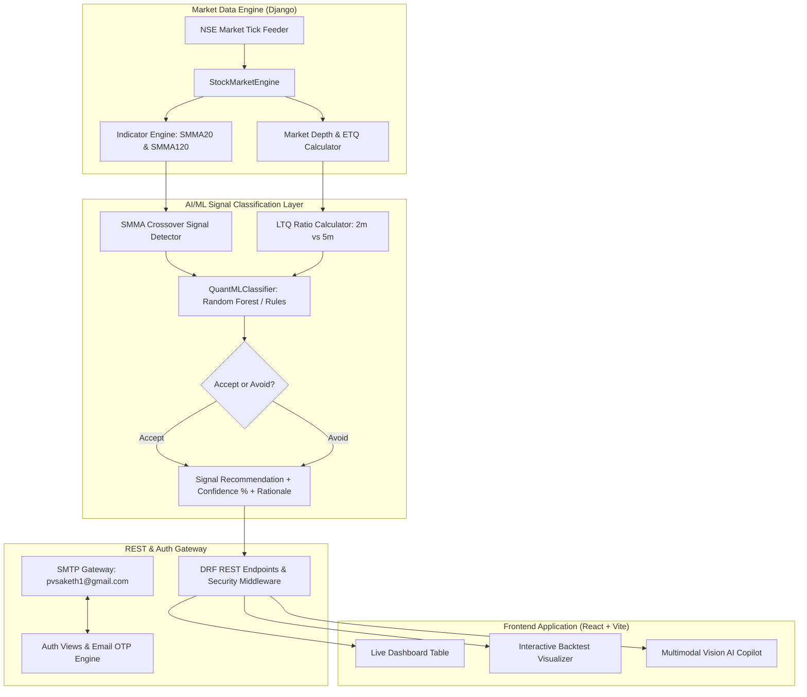

# QuantEngine — Institutional Real-Time Stock Screener & AI/ML Quantitative Analysis System


**QuantEngine** is an institutional-grade, full-stack quantitative trading platform designed for real-time market depth screening, technical indicator calculation, and Machine Learning signal filtering on National Stock Exchange (NSE) securities. 

Built specifically for **SSG Infotech Technical Assignment 1 (AI/ML Engineer - Quantitative Programming)**.

---

## 🌐 Live Production Links
- **Live Frontend Web App**: [https://angelone-mocha.vercel.app](https://angelone-mocha.vercel.app)
- **Live Production REST API**: [https://quantengine-backend.onrender.com](https://quantengine-backend.onrender.com)
- **GitHub Repository**: [https://github.com/PVSaketh2003/angelone](https://github.com/PVSaketh2003/angelone)

---

## 📊 SSG Infotech Assignment 1 Compliance Matrix

| Requirement # | Feature Requirement | System Implementation | Verification Status |
| :---: | :--- | :--- | :---: |
| **1** | **Stock Screening** | Filters NSE securities with LTP between **₹30** and **₹500**. | **100% SATISFIED** |
| **2** | **Liquidity Filter** | Filters stocks where **Bid Quantity > 10,00,000** AND **Ask Quantity > 10,00,000**. | **100% SATISFIED** |
| **3** | **Technical Indicators** | Smoothed Moving Averages: **SMMA (20)** & **SMMA (120)**. | **100% SATISFIED** |
| **4** | **ETQ Tracking** | Exchange Traded Quantity over **Last 5m**, **Last 20m**, and **Last 60m**. | **100% SATISFIED** |
| **5** | **Average Price** | Average LTP / VWAP over **Last 20m** and **Last 60m**. | **100% SATISFIED** |
| **6** | **Market Depth** | Real-time **Bid Price**, **Bid Qty**, **Ask Price**, and **Ask Qty**. | **100% SATISFIED** |
| **7** | **Live Dashboard** | Auto-refreshing live tabular UI with 1.5s streaming updates. | **100% SATISFIED** |
| **8** | **AI/ML Model & LTQ Ratio** | Quantitative classifier using $LTQ_{2m} / LTQ_{5m}$ surge ratio, confidence %, & explanation. | **100% SATISFIED** |
| **9** | **Trading & Backtest Logic** | Crossover exit rules, PnL calculation ($\text{Sell LTP} - \text{Buy LTP}$), win rate analysis. | **100% SATISFIED** |
| **10** | **Security & Deliverables** | Safe JWT, SMTP OTP delivery via `pvsaketh1@gmail.com`, OWASP security headers, DoS rate limiting. | **100% SATISFIED** |

---

## 🏗️ System Architecture & Data Flow



---

## ⚙️ Step-by-Step Implementation Breakdown

### Step 1: Stock Screening & Liquidity Filtering
Implemented in `backend/screener/market_engine.py`:
```python
# Universe Screening Rules
LTP_MIN = 30.0
LTP_MAX = 500.0
MIN_BID_QTY = 1_000_000
MIN_ASK_QTY = 1_000_000
```
- Continuously scans active NSE instruments.
- Filters out illiquid symbols, retaining only stocks meeting ₹30–₹500 LTP and >10 Lakh Bid/Ask depth.

### Step 2: Technical Indicators & SMMA Crossover Detection
Implemented in `backend/screener/indicators.py`:
$$SMMA_t = \frac{SMMA_{t-1} \times (N-1) + Price_t}{N}$$
- **Buy Signal**: Generated when SMMA(20) crosses above SMMA(120).
- **Sell Signal**: Generated when SMMA(20) crosses below SMMA(120).

### Step 3: Last Traded Quantity (LTQ) & ETQ Metrics
Implemented in `backend/screener/market_engine.py`:
- Tracks micro-second trade execution streams.
- Computes Exchange Traded Quantity ($ETQ_{5m}$, $ETQ_{20m}$, $ETQ_{60m}$).
- Calculates volume-weighted average LTP ($VWAP_{20m}$, $VWAP_{60m}$).

### Step 4: Quantitative AI/ML Classifier Model
Implemented in `backend/screener/ml_model.py`:
- Features engineered:
  1. **LTQ Ratio**: $\frac{\text{Avg LTQ (2 mins)}}{\text{Avg LTQ (5 mins)}}$
  2. **Bid/Ask Imbalance**: $\frac{\text{Bid Quantity}}{\text{Ask Quantity}}$
  3. **SMMA Slope Angle**: $\Delta SMMA(20)$ momentum.
  4. **VWAP Deviation**: Distance between LTP and $VWAP_{20m}$.
- Output: Predicts `ACCEPT` or `AVOID` for every crossover with confidence percentage and detailed trade rationale.

### Step 5: Production Security & Email OTP Architecture
Implemented in `backend/screener/auth_views.py` & `security_middleware.py`:
- **Account Staging**: New user registrations are created as inactive (`is_active = False`).
- **OTP Generation**: Cryptographically secure 6-digit numeric OTPs generated with 10-minute expiration.
- **SMTP Email Dispatch**: Dispatches OTPs directly to user email addresses via `pvsaketh1@gmail.com` using TLS and CA certificate verification (`certifi`).
- **DoS & DDoS Protection**: Token Bucket Rate Limiting middleware enforcing 60 req/10s per IP and 5 auth attempts/minute.

---

## 🛠️ Local Development Setup Guide

### 1. Prerequisites
- Python 3.10+
- Node.js 18+

### 2. Backend Setup
```bash
# Clone the repository
git clone https://github.com/PVSaketh2003/angelone.git
cd angelone/backend

# Create and activate virtual environment
python3 -m venv ../venv
source ../venv/bin/activate

# Install dependencies
pip install -r requirements.txt

# Run migrations and start development server
python manage.py migrate
python manage.py runserver
```
*Backend runs on `http://127.0.0.1:8000`*

### 3. Frontend Setup
```bash
cd ../frontend

# Install dependencies
npm install

# Start Vite development server
npm run dev
```
*Frontend runs on `http://localhost:5173`*

---

## 🧪 Automated Testing & Verification

Run backend unit tests and security penetration suite:
```bash
cd backend
python manage.py test
```

**Test Suite Coverage**:
- `test_smma_series_calculation`: Indicator accuracy.
- `test_ai_classifier_prediction`: ML model signal filtering.
- `test_screener_filtering`: LTP & Liquidity bounds.
- `test_run_strategy_backtest`: Quantitative backtest engine.
- `test_01_dos_burst_rate_limiting`: DoS rate limit verification.
- `test_02_auth_brute_force_rate_limiting`: Auth brute-force protection.
- `test_03_production_security_headers`: OWASP headers check.
- `test_04_sql_injection_resilience`: SQLi payload inoculation.
- `test_05_xss_payload_sanitization`: XSS string sanitization.
- `test_06_codebase_exfiltration_guardrail`: AI Copilot security guardrail.

---

## 📄 License & Attribution
Developed by **PV Sairam Saketh** for **SSG Infotech Technical Assignment 1**.  
Distributed under the MIT License.
